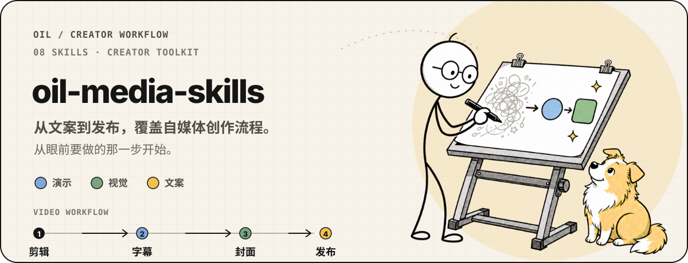

# oil-media-skills

  

`oil-media-skills` 是一组覆盖自媒体创作全流程的 Skill。从文案、演示和插图，到视频剪辑、字幕、封面和多平台发布，每个 Skill 帮你完成一个具体环节。你可以从眼前要做的那一步开始，也可以按自己的创作顺序把它们组合起来。

## 包含的 Skill

| 环节 | Skill | 能帮你完成什么 | 了解更多 |
| --- | --- | --- | --- |
| 文案 | `oil-tone` | 根据已有事实材料起草或润色口播、文章、演讲和产品介绍，让表达自然、清楚，不编造经历或结果。 | [oil-tone](https://github.com/oil-oil/oil-tone) |
| 演示 | `oil-ppt` | 把讲述内容做成清楚、可展示的演示文稿，逐页检查；需要时交付 PowerPoint。 | [oil-ppt](https://github.com/oil-oil/oil-ppt) |
| 插图 | `oil-visual` | 制作解释概念与流程的漫画墨线图，或供文章、演示和封面排版使用的透明角色插图。 | [oil-visual](https://github.com/oil-oil/oil-visual) |
| 工程剪辑 | `screen-studio-editor` | 整理 Screen Studio 录屏里的停顿、重讲和补录，也能让演示画面跟上口播。 | [screen-studio-editor](https://github.com/oil-oil/screen-studio-editor) |
| 成片粗剪 | `video-editor` | 剪掉口播视频里的长停顿与废弃重讲，交付剪好的视频和可复核的剪辑记录。 | [video-editor](https://github.com/oil-oil/video-editor) |
| 字幕 | `oil-subtitle` | 转录并校对中文字幕，预览后加进视频；需要时提供同时间轴的英文字幕文件。 | [oil-subtitle](https://github.com/oil-oil/oil-subtitle) |
| 封面 | `oil-cover` | 根据视频或脚本制作小红书与 B 站封面，输出适配不同展示位置的三种画幅。 | [oil-cover](https://github.com/oil-oil/oil-cover) |
| 发布 | `video-publisher` | 上传并验证小红书、抖音、B 站、视频号和 YouTube 草稿；默认停在最终发布前，用户明确要求时才完成发布。 | [video-publisher-skill](https://github.com/oil-oil/video-publisher-skill) |

如果你已经录好视频，可以先剪辑，再检查字幕、制作封面，最后准备平台草稿。讲解需要演示页或插图时，再用 `oil-ppt` 和 `oil-visual` 补充画面；文案可以交给 `oil-tone` 调整。

`auto-publish` 这条自动衔接字幕、封面和草稿的工作流仍在整理，暂未收录。

想使用某个 Skill，打开表格中的对应页面查看用法即可。
